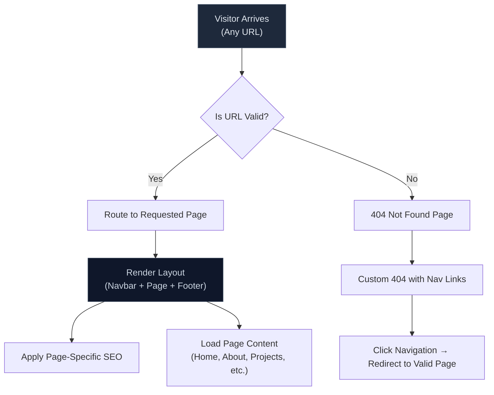
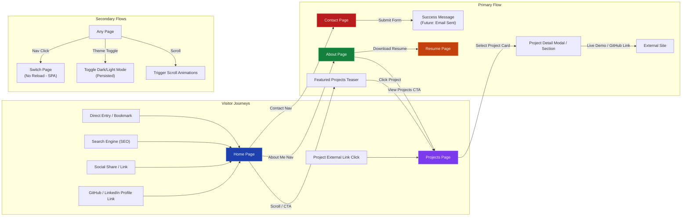
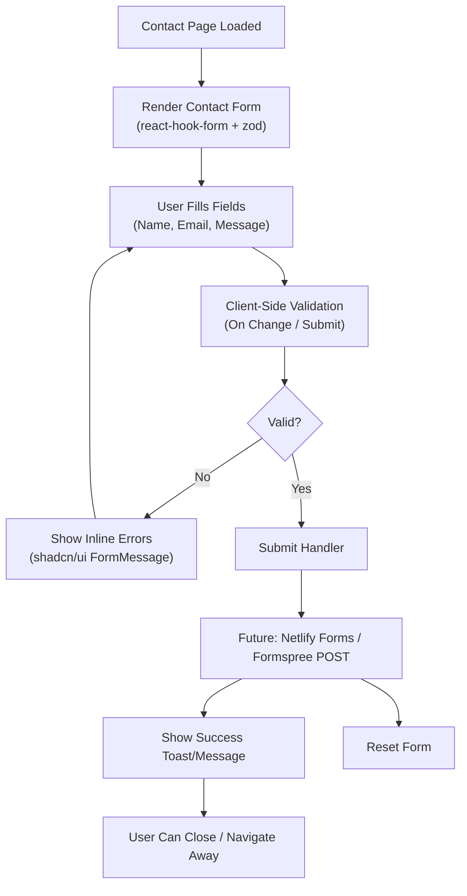
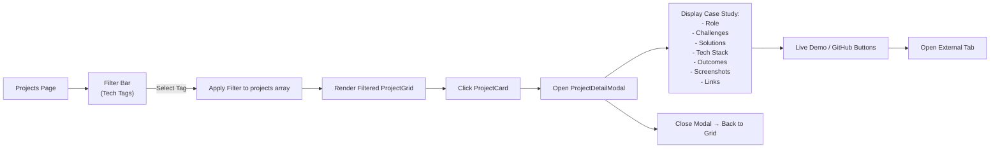
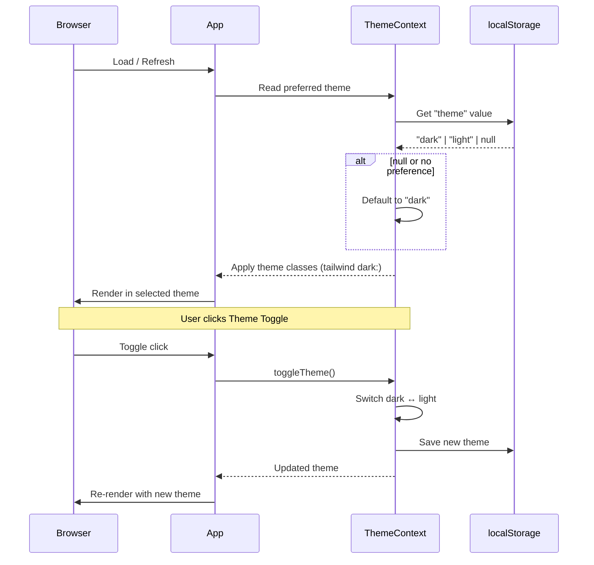

```mermaid
graph TD
    subgraph Global_Layout["Global Layout"]
        Root[App.tsx] --> Router[React Router]
        Router --> Layout["MainLayout.tsx<br/>(Navbar + Outlet + Footer)"]
        Layout --> Navbar["Navbar.tsx<br/>(Sticky, Links, Theme Toggle, Hamburger)"]
        Layout --> Outlet[Page Content]
        Layout --> Footer["Footer.tsx<br/>(Copyright, Social Links)"]
    end

    subgraph Pages
        Router --> Home[HomePage.tsx]
        Router --> About[AboutPage.tsx]
        Router --> Projects[ProjectsPage.tsx]
        Router --> Resume[ResumePage.tsx]
        Router --> Contact[ContactPage.tsx]
        Router --> Privacy[PrivacyPolicy.tsx]
        Router --> Terms[TermsOfService.tsx]
        Router --> NotFound[NotFoundPage.tsx]
    end

    subgraph Shared_Components["Shared Components"]
        Sections["sections/"] --> Hero[HeroSection.tsx]
        Sections --> SkillsGrid[SkillsGrid.tsx]
        Sections --> ProjectGrid[ProjectGrid.tsx]
        Sections --> Timeline[ExperienceTimeline.tsx]
        Sections --> TestimonialCarousel[TestimonialCarousel.tsx]
        Sections --> GitHubCalendar[GitHubContributions.tsx]

        Shared["shared/"] --> ProjectCard[ProjectCard.tsx]
        Shared --> ProjectModal[ProjectDetailModal.tsx]
        Shared --> Button[Button variants]
        Shared --> Card[Card.tsx]
        Shared --> FormComponents["Input, Textarea, etc."]
    end

    subgraph Data_Config["Data & Config"]
        Data["data/"] --> projects.ts
        Data --> skills.ts
        Data --> testimonials.ts
        Data --> experience.ts
        Config["config/app.config.ts"] --> branding["branding, navLinks, socials"]
    end

    Pages -->|use| Sections
    Pages -->|use| Shared
    Pages -->|"import data"| Data
    Pages -->|"import config"| Config
    Pages -->|"wrap with"| SEO[SEO.tsx Component]

    style Global_Layout fill:#0f172a,stroke:#334155,color:#e2e8f0
    style Pages fill:#1e293b,stroke:#475569,color:#cbd5e1
    style Shared_Components fill:#164e63,stroke:#0891b2,color:#a5f3fc
    style Data_Config fill:#365314,stroke:#84cc16,color:#f0fdf4
```

These Mermaid diagrams comprehensively cover the portfolio website:

- **Site Flow & Routing** – How pages are reached and fallback handled.
- **User Journeys** – Typical visitor paths and interactions.
- **Component Architecture** – Modular structure showing SOLID adherence (separation of layout, pages, reusable sections, data).
- **Contact Form Flow** – Detailed user interaction with validation.
- **Projects Interaction Flow** – Filtering and deep dive into project details.
- **Theme Toggle Sequence** – Persistence and application of dark mode.
